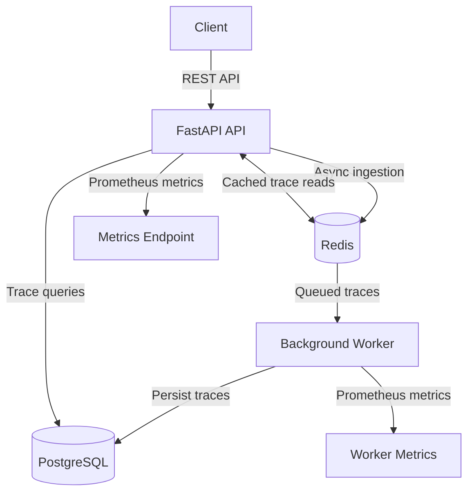

# TraceLab

TraceLab is a containerized backend observability service for ingesting, storing, and querying distributed trace data. It uses asynchronous ingestion with Redis and a background worker to decouple API request handling from PostgreSQL persistence.

The project was built to explore backend system design concepts including asynchronous processing, caching, observability, containerization, load testing, CI, and cloud deployment.

## Architecture




The API accepts trace data and places asynchronous ingestion requests onto a Redis queue. A separate worker consumes queued traces and persists them to PostgreSQL.

Redis is also used to cache trace retrievals, reducing repeated database queries.

## Tech Stack

- **Backend:** Python, FastAPI, Pydantic, SQLAlchemy
- **Database:** PostgreSQL
- **Caching & Queue:** Redis
- **Infrastructure:** Docker, Docker Compose
- **Cloud:** AWS EC2
- **Testing:** Pytest, HTTPX
- **Load Testing:** Locust
- **Observability:** Prometheus metrics, structured JSON logging
- **CI:** GitHub Actions

## Features

- REST API for trace and span ingestion
- Trace filtering and pagination
- Parent-child span relationships
- Redis-backed trace caching with TTL
- Asynchronous trace ingestion using a Redis queue
- Independent background persistence worker
- Duplicate trace handling
- Structured JSON application and worker logs
- Prometheus-compatible API and worker metrics
- Dockerized multi-service architecture
- PostgreSQL health-aware container startup
- Automated API tests
- GitHub Actions continuous integration
- Locust load testing
- AWS EC2 deployment

## Asynchronous Ingestion

Trace ingestion is exposed through:

```http
POST /api/v1/traces/ingest
```

Instead of waiting for PostgreSQL persistence, the API serializes the trace and places it on a Redis queue.

The API responds with `202 Accepted`, while a separate worker consumes the queue and writes traces to PostgreSQL.

This separates API request handling from database persistence and allows ingestion and processing to operate independently.

## API

### Health

```http
GET /health
```

### Create Trace

```http
POST /api/v1/traces
```

### Asynchronous Trace Ingestion

```http
POST /api/v1/traces/ingest
```

### Retrieve Trace

```http
GET /api/v1/traces/{trace_id}
```

### Query Traces

```http
GET /api/v1/traces
```

Supports filtering by service, status, and minimum duration, along with pagination.

### Create Span

```http
POST /api/v1/spans
```

### Retrieve Trace Spans

```http
GET /api/v1/traces/{trace_id}/spans
```

### Metrics

```http
GET /metrics
```

## Performance Testing

TraceLab was load-tested locally in Docker using Locust against the asynchronous ingestion endpoint.

| Concurrent Users | Requests | Avg Throughput | p50 | p95 | p99 | Failures |
|---:|---:|---:|---:|---:|---:|---:|
| 10 | 2,308 | 79.62 req/s | 11 ms | 21 ms | 28 ms | 0% |
| 50 | 10,725 | 369.18 req/s | 17 ms | 33 ms | 57 ms | 0% |
| 100 | 14,109 | 484.12 req/s | 60 ms | 96 ms | 180 ms | 0% |

During the 100-user test, steady throughput reached approximately **500 requests/second** with **0% HTTP failures** and **96 ms p95 API response latency**.

These measurements were collected in a local Docker environment and represent API ingestion/enqueue performance rather than direct PostgreSQL persistence throughput.

## Observability

TraceLab exposes Prometheus-compatible metrics for both the API and background worker.

Tracked metrics include:

- traces submitted for ingestion
- successfully processed traces
- duplicate traces
- trace-duration distribution

The worker also emits structured JSON logs containing fields such as trace ID, service name, duration, timestamp, and log level.

## Testing & CI

The automated test suite covers core API behavior, trace/span relationships, caching, and asynchronous queue ingestion.

GitHub Actions runs the test suite against PostgreSQL and Redis services on each CI run.

## Deployment

TraceLab is deployed on **AWS EC2** using Docker Compose.

The cloud deployment runs four containerized services:

```text
FastAPI API
Background Worker
PostgreSQL
Redis
```

Docker Compose health checks ensure the API and worker wait for PostgreSQL to become healthy before starting.

PostgreSQL and Redis are kept internal to the Docker network rather than exposed publicly.

## Running Locally

Clone the repository:

```bash
git clone https://github.com/ayraagrawal-byte/tracelab.git
cd tracelab
```

Start the stack:

```bash
docker compose up --build -d
```

Check the API:

```bash
curl http://localhost:8000/health
```

Open the interactive API documentation at:

```text
http://localhost:8000/docs
```

Run tests:

```bash
pytest
```

## Project Structure

```text
tracelab/
├── .github/workflows/
│   └── ci.yml
├── app/
│   ├── cache.py
│   ├── database.py
│   ├── ingestion.py
│   ├── logging_config.py
│   ├── main.py
│   ├── metrics.py
│   ├── models.py
│   ├── schemas.py
│   └── worker.py
├── tests/
├── docker-compose.yml
├── Dockerfile
├── locustfile.py
└── requirements.txt
```
